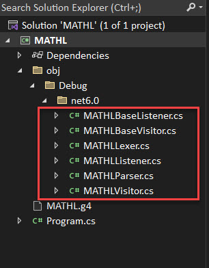
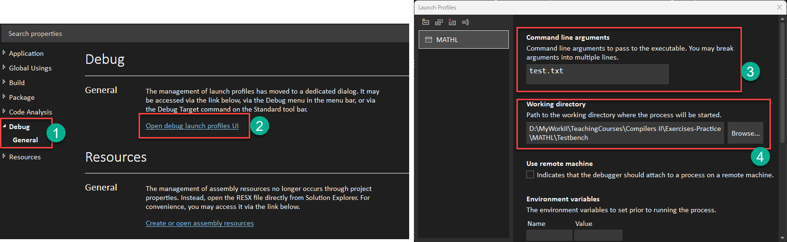

# Instructions to set the Startup ANTLR4 project in Visual Studio 2022
1) Create a .NETCORE project
2) From NUGET Package Manager install Antlr4BuildTasks and Antlr4.Runtime.Standard packages
   
   or inject the following into the .csproj file after substituting the latest version of each nuget
```c#
    <ItemGroup>
    <PackageReference Include="Antlr4.Runtime.Standard" Version="X.XX.X" />
    <PackageReference Include="Antlr4BuildTasks" Version="X.XX.X" PrivateAssets="all" />
    </ItemGroup>
```
3) Add grammar file/s to the project and from properties tag it/them as ANTLR4 grammar file/s
   
   or inject the following into the .csproj file 
```c#
<ItemGroup>
    <Antlr4 Include="MyGrammar.g4" />
</ItemGroup>
```
4) Compile

    Produces errors if the grammar file is empty
    
5) Add the startup contents to ANTLR grammar file and compile
```
grammar MATHL;

/* 
Parser Rules
*/

compile_unit:
;


/*
Lexer Rules
*/
NEWLINE :[ \r\n\t] ->skip;
```
6) As long as it compiles add the generated files in obj/debug/net6.0 folder to the project **as link**



7) Add the parser startup C# code in ```Program.cs``` file

```c#
using Antlr4.Runtime;
using Antlr4.Runtime.Tree;

Console.WriteLine("Hello, World!");

StreamReader aReader = new StreamReader(args[0]);
AntlrInputStream antlrstream = new AntlrInputStream(aReader);
MATHLLexer lexer  = new MATHLLexer(antlrstream);
CommonTokenStream tokens = new CommonTokenStream(lexer);
MATHLParser parser = new MATHLParser(tokens);
IParseTree tree= parser.compile_unit();
Console.WriteLine(tree.ToStringTree());
```

8) Create a Testbench directory into project directory and create a test file as input to the parser. Set the working directory to testbench and name of the input file in command line arguments




9) Create a Facade class MATHLProcessor for the Compiler/Interpreter. Provide the ability
    1. Read from the console
        When reading from the console the parser works interactively. It evaluates 
        each command and displays the result when the newline terminates the command
        or evaluates the command and modifies the parser state if a semicolon terminates
        the command.
    2. Read from one or multiple input files
        The parser accepts one or multiple input files and after processing it can 
        continue in interactive mode accepting more commands interactively
    3. Interactive code blocks
        The user can provide multiple commands in a row through nested blocks of code delimeted with
        curly braces {}. The MATHL processor postpones the processing of commands until the last
        closing curly brace is pressed followed by ENTER
        


